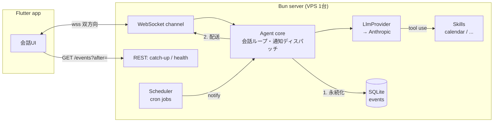

# okabe

サーバーに常駐する個人用AIエージェント。自作クライアントから話しかけると応答し、
エージェント側からも定期ジョブを起点に**能動的に通知してくる**。

- シングルユーザー専用・セルフホスト前提（安価なVPS 1台で完結）
- 最初のユースケースはスケジュール支援（Googleカレンダー連携）。機能は「スキル」として追加していく
- サーバー: **Bun + Hono + TypeScript + SQLite (Drizzle)** / クライアント: **Flutter**

## アーキテクチャ



### 設計の要: 配送チャネルを信頼しない

エージェント発のイベント（応答・通知とも）は、**必ず先に SQLite の受信箱（`events` テーブル）へ
永続化してから**接続中のクライアントに配送する。クライアントは再接続時・起動時に
`GET /events?after=<最終受信ID>` で差分を取り寄せる（catch-up）。

これにより WebSocket が切れていてもイベントは失われず、将来のモバイルプッシュ（FCM）は
「新着があるよ、と端末を起こすだけの装置」として `Channel` 実装1つの追加で済む。
詳細は [ADR-0003](docs/adr/0003-websocket-inbox-catchup.md)。

### 拡張の縫い目は4つだけ

| インターフェース | 役割 | 将来の差し込み |
|---|---|---|
| `LlmProvider` | `chat(messages, tools, { tier })` | 軽量/上位モデルの階層ルーティング、別プロバイダー |
| `Skill` | tool定義 + 実行 + ジョブ登録 | 案件監視などの新ユースケース |
| `Channel` | 永続化済みイベントの配送 | CLI / Web / FCM / メッセンジャー連携 |
| `JobDef` | cron スケジュールと実行 | スキルによる定期実行・監視 |

過度な抽象化はしない。各インターフェースの実装は1個から始める。

## 技術選定の理由

各決定は ADR（Architecture Decision Record）として残している。

| 選定 | なぜ | ADR |
|---|---|---|
| Bun + Hono | 常駐デーモンに必要な runtime / SQLite / WS / test を1バイナリに集約し依存を最小化。Hono の Web Standards 準拠がランタイム乗り換えの保険 | [0001](docs/adr/0001-bun-runtime.md) |
| SQLite + Drizzle | 個人エージェントの真の運用コストはDBの世話。pgvector が欲しくなった時の移行経路（sqlite-vec / dialect差し替え）を確認した上で運用ゼロの側から開始 | [0002](docs/adr/0002-sqlite-drizzle.md) |
| WS + 受信箱 + catch-up | 双方向要件に対し接続管理を1本に集約。配信保証はDBが担う | [0003](docs/adr/0003-websocket-inbox-catchup.md) |
| Flutter | 学習予算はサーバー側に全振り。iOS Web Push の制約から PWA を棄却 | [0004](docs/adr/0004-flutter-client.md) |
| 自前 LlmProvider | エージェントループ（tool use ルーティング）が本体。メタフレームワークに預けない | [0005](docs/adr/0005-own-llm-abstraction.md) |
| 静的Bearerトークン | シングルユーザーに OAuth/JWT は攻撃面と保守負担の増加でしかない | [0006](docs/adr/0006-static-bearer-token.md) |

全体設計は [docs/design.md](docs/design.md)。

## セットアップ

### 必要なもの

- [Bun](https://bun.sh/) 1.2+
- Flutter 3.44+（[fvm](https://fvm.app/) 推奨。`app/.fvmrc` にピン留め済み）

### サーバー

```bash
cd server
bun install
cp .env.example .env
# .env を編集:
#   AUTH_TOKEN         に `openssl rand -base64 32` の値を設定
#   ANTHROPIC_API_KEY  を設定（未設定でも起動するが、応答はエコーになる）
bun run dev
```

`http://localhost:8787/health` が `{"ok":true}` を返せば起動している。
モデルは `ANTHROPIC_MODEL` で変更可能（省略時 `claude-opus-4-8`）。

### クライアント

```bash
cd app
fvm flutter pub get
fvm flutter run -d macos \
  --dart-define=AGENT_URL=http://localhost:8787 \
  --dart-define=AGENT_TOKEN=<AUTH_TOKEN と同じ値>
```

メッセージを送ると、会話履歴を踏まえた応答がストリーミングで表示される。
応答の断片（`assistant_delta`）は永続化されない一時フレームで、確定文だけが受信箱に載る —
切断中に取りこぼしても catch-up で完全な形が届く、という M1 の原則をそのまま保っている。

### M3: Google カレンダー連携のセットアップ（手動手順）

calendar スキルを有効にするには、一度だけ以下の手順で refresh token を取得する。

**1. GCP コンソール側の準備**（[console.cloud.google.com](https://console.cloud.google.com/)）

1. プロジェクトを作成（既存でも可）
2. 「APIとサービス → ライブラリ」で **Google Calendar API** を有効化
3. 「APIとサービス → OAuth同意画面」を構成
   - User Type: **外部** / 公開ステータスは「テスト」のままでよい
   - **テストユーザーに自分の Google アカウントを追加**（これを忘れると認可時に 403）
4. 「APIとサービス → 認証情報 → 認証情報を作成 → OAuth クライアント ID」
   - アプリケーションの種類: **デスクトップアプリ**
   - 発行された「クライアント ID」と「クライアント シークレット」を控える

**2. 初回認可（ローカルで一度だけ）**

```bash
cd server
# .env に GOOGLE_CLIENT_ID / GOOGLE_CLIENT_SECRET を記入してから:
bun scripts/google-auth.ts
# → 表示された URL をブラウザで開いて認可（スコープは calendar.readonly のみ）
# → ターミナルに表示された GOOGLE_REFRESH_TOKEN=... を .env に追記
```

**3. サーバーを再起動**すると起動ログに `skills: list_events, find_free_slots` が出る。
「明日の予定は？」「来週空いてる日は？」に答えられるようになる。

補足:
- スコープは読み取り専用（`calendar.readonly`）。予定の作成・変更はできない
- refresh token は「テスト」ステータスのアプリでは**7日で失効**する場合がある（Google の仕様）。
  失効したら手順2を再実行。長く使うなら OAuth 同意画面を「本番」に公開する（審査は
  readonly スコープなら不要）
- 空き時間の計算は 8:00〜20:00（Asia/Tokyo）の範囲・コード側の決定的ロジックで行う。
  LLM は日付の解釈と結果の言語化のみを担当し、予定をでっち上げられない構造にしている

### 本番配置（VPS）

systemd + リバースプロキシ（Caddy 等で HTTPS 終端）を想定。手順は M4 までに `docs/` に追記予定。

## 開発

```bash
# サーバー: lint + 型チェック + テスト
cd server && bun run check && bunx tsc --noEmit && bun test

# クライアント
cd app && fvm flutter analyze && fvm flutter test

# E2E（実サーバー × 実クライアント。手順は app/test/e2e_test.dart 冒頭を参照）
```

## ロードマップ

| MS | 内容 | 状態 |
|---|---|---|
| M0 | 設計（スタック選定・プロトコル・ADR） | ✅ |
| M1 | メッセージ往復の成立（WS + 認証 + 受信箱 + catch-up + エコー） | ✅ |
| M2 | LLM会話（Anthropic、会話履歴つきストリーミング応答） | ✅ |
| M2.5 | プロンプトキャッシング + トークン消費の計測（`bun run usage`） | ✅ |
| M3 | カレンダースキル（Google OAuth2 / freebusy） | ✅ |
| M4 | 能動通知（定期ジョブ → 毎朝の予定サマリー） | 🔜 |
| 以降 | FCMプッシュ / 案件監視スキル / 階層LLMルーティング | — |

## リポジトリ構成

```
okabe/
├── server/            # Bun + Hono + Drizzle（エージェント本体）
│   ├── src/
│   │   ├── core/      # エージェントループ（tool use ルーティング）、通知ディスパッチ
│   │   ├── llm/       # LlmProvider + anthropic 実装（キャッシング含む）
│   │   ├── skills/    # Skill インターフェース + calendar/
│   │   ├── channels/  # Channel インターフェース + websocket/
│   │   ├── jobs/      # スケジューラ（M4）
│   │   ├── store/     # Drizzle スキーマ + リポジトリ
│   │   └── http/      # Hono ルーティング、認証
│   ├── scripts/       # google-auth（OAuth初回認可）、usage-report
│   └── drizzle/       # マイグレーション
├── app/               # Flutter クライアント
├── docs/              # 設計ドキュメント + ADR
└── .github/workflows/ # CI
```
