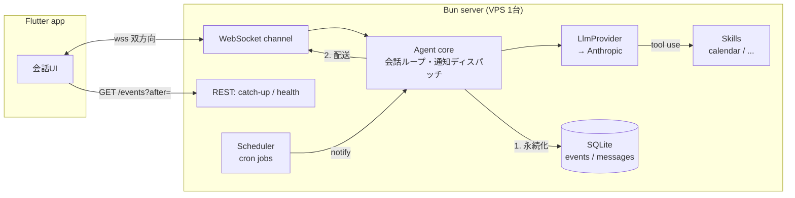

# okabe — 個人用常駐AIエージェント 設計ドキュメント

承認日: 2026-07-13（M0）

## 1. これは何か

サーバーに常駐するシングルユーザー専用のAIエージェント。自作クライアント（Flutter）から話しかけると応答し、
エージェント側からも定期ジョブ・監視トリガーを起点に**能動的に通知**してくる。

- 最初のユースケース: スケジュール支援（Googleカレンダーの空き参照・予定確認・候補日提案）
- 将来ユースケース（案件監視など）は「スキル」として追加する

## 2. 全体アーキテクチャ



### レイヤと縫い目（インターフェース）

| 縫い目 | シグネチャ | 将来の差し込み |
|---|---|---|
| `LlmProvider` | `chat(messages, tools, { tier }) → stream` | 階層ルーティング（軽量/上位モデル）、別プロバイダー |
| `Skill` | `{ name, tools, execute(call), jobs? }` | 案件監視スキル等の追加 |
| `Channel` | `{ deliver(event) }` | CLI / Web / FCM / メッセンジャー連携 |
| `JobDef` | `{ schedule, run(ctx) }` | スキルによる定期実行・監視の登録 |

抽象はこの4つだけ。各インターフェースの実装は1個から始め、DIコンテナ等は導入しない。

## 3. 通信プロトコル

### 原則: 通知の真実はサーバーのDB、配送は best effort

1. エージェント発のイベント（応答・通知とも）は**必ず先に** SQLite の `events` テーブルに永続化し、単調増加のIDを振る
2. 配送はその後。WSが切れていても失われない
3. クライアントは `GET /events?after=<最終受信ID>` で差分同期（catch-up）する

これにより配送チャネルは信頼性の責務から解放され、将来のFCMは「端末を起こす装置」として
`Channel` 実装1個の追加で済む（コア・プロトコル無変更）。

### チャネル

- **WebSocket 1本（双方向）**: client→server は `user_message`、server→client は `assistant_message` / `notification` 等
- **REST**: `GET /events?after=` (catch-up), `GET /health`
- 切断検知は ping/pong、再接続はクライアント側の指数バックオフ

### エンベロープ（Zodスキーマが正）

```jsonc
// server → client（events テーブルの1行がそのまま配送単位）
{ "id": 42, "type": "assistant_message", "ts": "2026-07-13T09:00:00Z", "payload": { "text": "..." } }
// client → server
{ "type": "user_message", "payload": { "text": "..." } }
```

### 認証

環境変数の静的Bearerトークン1本。WSハンドシェイクとREST全域で検証。HTTPS終端はリバースプロキシ（Caddy）。
シングルユーザー前提の意図的な最小構成（[ADR-0006](adr/0006-static-bearer-token.md)）。

### プッシュ通知の段階設計

- **Phase 1（M4まで）**: フォアグラウンドWSのみ。非接続時のイベントは受信箱に溜まり、次回起動時のcatch-upで届く
- **Phase 2（M4後）**: FCM data message（本文なし・「新着あり」のみ）→ アプリが起きてcatch-up

## 4. 技術スタック

| 層 | 選定 | ADR |
|---|---|---|
| ランタイム | Bun + TypeScript | [0001](adr/0001-bun-runtime.md) |
| Webフレームワーク | Hono | [0001](adr/0001-bun-runtime.md) |
| 永続化 | SQLite + Drizzle ORM | [0002](adr/0002-sqlite-drizzle.md) |
| 通信 | WebSocket + イベント受信箱 + catch-up | [0003](adr/0003-websocket-inbox-catchup.md) |
| クライアント | Flutter + Riverpod | [0004](adr/0004-flutter-client.md) |
| LLM | 自前 `LlmProvider` 抽象 + Anthropic SDK | [0005](adr/0005-own-llm-abstraction.md) |
| 認証 | 静的Bearerトークン | [0006](adr/0006-static-bearer-token.md) |

## 5. リポジトリ構成

```
okabe/
├── server/            # Bun + Hono + Drizzle（エージェント本体）
│   └── src/
│       ├── core/      # エージェントループ、通知ディスパッチ
│       ├── llm/       # LlmProvider + anthropic 実装
│       ├── skills/    # Skill インターフェース + calendar/
│       ├── channels/  # Channel インターフェース + websocket/
│       ├── jobs/      # スケジューラ
│       ├── store/     # Drizzle スキーマ + リポジトリ
│       └── http/      # Hono ルーティング、認証
├── app/               # Flutter クライアント
├── docs/adr/          # Architecture Decision Records
└── .github/workflows/ # CI (lint + test)
```

モノレポ。パッケージ2個にTurborepo等は過剰なので入れない。

## 6. マイルストーン

| MS | 内容 | 動作確認 |
|---|---|---|
| M1 | WS+認証+受信箱+エコー / Flutter最小UI+再接続+catch-up | 往復成立。切断中のイベントが再接続で届く |
| M2 | LlmProvider+Anthropic、履歴付きストリーミング応答 | 文脈を踏まえた応答 |
| M3 | Skill機構+calendarスキル（OAuth2 / freebusy） | 「明日の予定」「来週の空き」に回答 |
| M4 | ジョブ機構+毎朝サマリー通知 | 通知がアプリに届く |

## 7. やらないこと

マルチユーザー / 認証基盤の作り込み / 管理画面 / Kubernetes / Turborepo / メタフレームワークによるLLM抽象 /
UIの作り込み。階層LLMルーティングと案件監視スキルはM4後、日常運用が回ってから。
